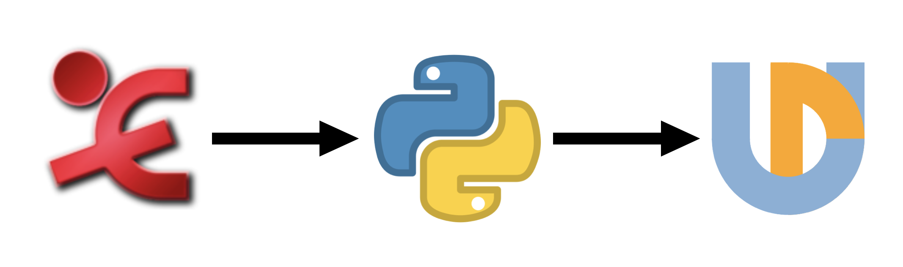

```{r setup, include=FALSE}
knitr::opts_chunk$set(echo = TRUE)
```


```{r, echo=FALSE}
library(lingglosses)
```

<!-- # Intro -->

<!-- This file describes principles of the Universal Dependencies (UD) annotation of the spoken corpus of Abaza. For more information on the UD annotation, see [UD Guidelines](https://universaldependencies.org/guidelines.html). -->

<!-- Before annotation: tokenization and word segmentation -->

<!-- -   All words are converted to lower case. -->
<!-- -   All punctuation marks are removed from the texts. -->
<!-- -   Words are delimited by whitespace characters. -->

<!-- To-do list: -->

<!-- -   for nominal complexes a morpheme level should be added (cf. incorporation in Chukchi) -->
<!-- -   save at least some punctuation? -->
<!-- -   switch to enhanced dependencies? -->

# Intro 

## Universal dependencies 

- Dependency grammar-based syntactic annotation 
- 200 treebanks for ~100 languages 
- Treebanks can be used for different NLP tasks, linguistic typology, etc. 

## CoNLL-U format

Annotation format that is used for UD treebanks 

```
1    They     they    PRON    PRP    Case=Nom|Number=Plur               2    nsubj    2:nsubj|4:nsubj
2    buy      buy     VERB    VBP    Number=Plur|Person=3|Tense=Pres    0    root     0:root
3    and      and     CONJ    CC     _                                  4    cc       4:cc
4    sell     sell    VERB    VBP    Number=Plur|Person=3|Tense=Pres    2    conj     0:root|2:conj
5    books    book    NOUN    NNS    Number=Plur                        2    obj      2:obj|4:obj
6    .        .       PUNCT   .      _                                  2    punct    2:punct
```

This is how it can be visually represented: 

<embed src="svg-files/eng.svg" type="image/svg+xml" />

## Polysynthetic languages in UD

- 2 languages to date (Yupik and Chukchi)
- @park2021expanding: 'Word-level annotation results in degenerate trees for some Yupik sentences and often fails to capture syntactic relations that can be manifested at the morpheme level.'

<embed src="svg-files/yupik2.svg" type="image/svg+xml" />

- Should we adopt the same strategy for Abaza? @tyers2020dependency propose to use word-level annotation to correctly represent noun incorporation in Chuckhi. 
- Old Abaza treebank needs to be updated (@park2021expanding: 'The Abaza treebank, as released in UD v2.7, contains 33 sentences and does not provide any language-specific docu- mentation.')

## Pipeline: 

- Simple command-line based interface:

```
python3 EafToUD.py <ELAN directory> <out CoNLLi> <XPOS>
```




# POS Tags

Abaza uses all universal POS tags except `PUNCT` and `SYM`.


1. `ADJ` (adjective): nominals which modify another nominal.
```{r, echo=FALSE}
gloss_example(transliteration = "h-an **rəcha** l-hatər-la",
             glosses = "1PL.PR-мать бедный 3SG.F.PR-услуга-INS",
              free_translation = "благодаря нашей бедной маме",
              annotation = "хI-ан рыцхIа л-хIатыр-ла")
```


2. `ADP` (adposition): all Abaza postpositions.
```{r, echo=FALSE}
gloss_example(transliteration = "allah **j-pnə** h-argʷanə-ta",
              glosses = "аллах 3SG.M.IO-возле 1PL.ABS-близкий-ADV",
              free_translation = "чтобы мы приблизились к Аллаху",
              annotation = "аллахI й-пны хI-аргваны-та")
```


3. `ADV` (adverb): verbal modifiers which specify manner, time or place.
```{r, echo=FALSE}
gloss_example(transliteration = "a-raχʷ **χʷəjt-ta** **dara-dara** tə-c̣-əj-ṭ **š’əmta-la**",
              glosses = "DEF-скот свободный-ADV 3PL-3PL LOC.ELAT-идти-PRS-DCL утро-INS",
              free_translation = "Коровы сами выходят по утрам",
              annotation = "а-рахв хвит-та дара-дара ты-цI-и-тI щымта-ла")
```

4. `AUX` (auxiliary): the verb _č’pa-_ 'do' with borrowings, copula (not sure).
```{r, echo=FALSE}
gloss_example(transliteration = "a-naməca-kʷa bombit’ **ʕa-r-č’pa-n**",
              glosses = "DEF-немец-PL бомбить CSL-3PL.ERG-делать-PST",
              free_translation = "(Ростов) немцы бомбили",
              annotation = "а-намыца-ква бoмбить гIа-р-чпа-н")


```


5. `CCONJ` (coordinating conjunction): _jg’əj_ 'and', _ja_ 'or', etc.
```{r, echo=FALSE}
gloss_example(transliteration = "**ja** čĉ̣ara-ḳ **ja** warad-ḳ",
              glosses = "или куплет-INDF или песня-INDF",
              free_translation = "или куплет или песню",
              annotation = "я тшчIвара-кI я уарад-кI")

```


6. `DET` (determiner): demonstrative pronouns and personal pronouns used as possessors (do we really need this category?).
a.
```{r, echo=FALSE}
gloss_example(transliteration = "**anəj** a-ʒə j-c̣-na-hʷa-kʷa-z",
              glosses = "MED DEF-вода 3PL.ABS-LOC-3SG.N.ERG-вытягивать-Pl-PST.NFIN",
              free_translation = "эта вода высосала из нас всё",
              annotation = "ани а-дзы й-цI-на-хIва-ква-з")

```
b.
```{r, echo=FALSE}
gloss_example(transliteration = "**sara** s-an d-adəg’a-b",
              glosses = "1SG 1SG.PR-мама 3SG.H.ABS-черкес-NPST.DCL",
              free_translation = "моя мама черкешенка",
              annotation = "сара с-ан д-адыгьа-б")

```


7. `INTJ` (interjection): _š’ta_ 'yes', _mawmaw_ ‘no’.
```{r, echo=FALSE}
gloss_example(transliteration = "**š’ta** s-hʷa-ṭ",
              glosses = "да 1SG.ERG-говорить(AOR)-DCL",
              free_translation = "я сказал «Да»",
              annotation = "щта с-хIва-тI")

```


8. `NOUN` (noun): nominal arguments/adjuncts.
```{r, echo=FALSE}
gloss_example(transliteration = "j-ẑṗa-χa-wa-mca **a-ẑəwmp-kʷa**",
              glosses = "3PL.ABS-густой-INC-IPF-CVB DEF-ягода-PL",
              free_translation = "Гуще стало ягод",
              annotation = "й-жвпIа-ха-уа-мца а-жвумп-ква")
```


9. `NUM` (numeral): words denoting numbers.
```{r, echo=FALSE}
gloss_example(transliteration = "a-skʷšə **zk’əj** **ẑŝəj** **ʕʷaẑə** **ẑba** asqan",
              glosses = "DEF-год тысяча девятьсот двадцать девять во.время",
              free_translation = "(она родилась) в 1929-ом году",
              annotation = "а-сквшы зкьи жвшви гIважвы жвба асхъан")
```


10. `PART` (particle): _š’ta_, maybe also _hʷa_ (in some cases).
```{r, echo=FALSE}
gloss_example(transliteration = "**š’ta** č-a-d-h-ḳələ-n",
              glosses = "PTCL RFL-DAT-LOC-1Pl.ERG-собираться-PST",
              free_translation = "Мы вместе собрались",
              annotation = "щта тш-а-д-хI-кIылы-н")
```


11. `PRON` (pronoun): personal pronouns (used as arguments), demonstrative pronouns in the function of personal pronouns.
```{r, echo=FALSE}
gloss_example(transliteration = "**sara** aĉ̣ʷə-ja jə-s-č’p-əw-šə-z",
              glosses = "1SG что-QN REL.ABS-1SG.ERG-делать-IPF-FUT-PST.NFIN",
              free_translation = "Что мне было делать?",
              annotation = "сара ачIвы-йа йы-с-чп-у-шы-з")
```


12. `PROPN` (proper noun): personal names, names of places, etc.
```{r, echo=FALSE}
gloss_example(transliteration = "**abdulgamid** j-aš’a-hba",
              glosses = "Абдулгамид 3SG.M.PR-брат-старший",
              free_translation = "старший брат Абдулгамида",
              annotation = "абдулгамид й-аща-хIба")
```


13. `SCONJ` (subordinating conjunction): _hʷa_ when used as a complementizer.
```{r, echo=FALSE}
gloss_example(transliteration = "žena taš’i galuški **hʷa** awəj j-hʷa-d-ja",
              glosses = "жена(R) тащи(R) галушки(R) QUOT DIST.SG 3SG.M.ERG-говорить-DCL-PTCL",
              free_translation = "[жена, тащи галушки (по-русски)]  – он говорит",
              annotation = "жена тащи галушки хIва ауи й-хIвА-д-йа")
```


14. `VERB` (verb): all wordforms with verbal morphology (see the list of verbal affixes in the next section).
```{r, echo=FALSE, results='asis'}
gloss_example(transliteration = "apqa a-zaman waʕa.qa-ta a-dəwnaj **jə-kʷə-z** **š-abga-z** **j-azḳḳə-ta** zǯ’ara **j-bzaz-əw-n**",
              glosses = "раньше DEF-время народ-ADV DEF-мир REL.ABS-быть_на-PST.NFIN REL.MNR-целый-PST.NFIN 3PL.ABS-собираться-ADV где_то 3PL.ABS-жить-IPF-PST",
              free_translation = "в то время люди, которые находились на свете, собравшись, жили где-то",
              annotation = "апхъа а-заман уагIа.хъа-та а-дунай йы-квы-з ш-абга-з й-азкIкIы-та зджьара й-бзаз-у-н")
```


15. `X` (other).

No examples of `X` are found in the corpus yet.


# Morphological Features

Tables in 3.1-3.3 show correspondences between glosses used in the Abaza corpus and morphological features from the standard UD set of morphological features.

## Definiteness

| Gloss   | POS   | Morphological features      |
| ------|:-----:| :---------------------------|
| def   | NOUN	| Definite=Def |
| indf	| NOUN	| Definite=Ind |

## Personal prefixes

Note: `io` is not included in the standard UD set of arguments.

Question: is it necessary to introduce `Animacy`? We can use `Gender=Fem,Masc` or `Gender=Com` for human referents and `Gender=Neut` for nonhuman referents instead.

| Gloss   | POS   | Morphological features      |
| ------|:-----:| :---------------------------|
| 1sg.abs   | VERB	| Person[abs]=1\|Number[abs]=Sing |
| 1sg.erg	  | VERB	| Person[erg]=1\|Number[erg]=Sing |
| 1sg.io    | VERB	| Person[io]=1\|Number[io]=Sing   |
| 1sg.pr	  | NOUN	| Person[psor]=1\|Number[psor]=Sing |
| 1pl.abs   | VERB	| Person[abs]=1\|Number[abs]=Plur |
| 1pl.erg	  | VERB	| Person[erg]=1\|Number[erg]=Plur |
| 1pl.io    | VERB	| Person[io]=1\|Number[io]=Plur   |
| 1pl.pr	  | NOUN	| Person[psor]=1\|Number[psor]=Plur |
| 2sg.m.abs   | VERB	| Person[abs]=2\|Number[abs]=Sing\|Gender[abs]=Masc |
| 2sg.m.erg	  | VERB	| Person[erg]=2\|Number[erg]=Sing\|Gender[erg]=Masc |
| 2sg.m.io    | VERB	| Person[io]=2\|Number[io]=Sing\|Gender[io]=Masc   |
| 2sg.m.pr	  | NOUN	| Person[psor]=2\|Number[psor]=Sing\|Gender[psor]=Masc |
| 2sg.f.abs   | VERB	| Person[abs]=2\|Number[abs]=Sing\|Gender[abs]=Fem |
| 2sg.f.erg	  | VERB	| Person[erg]=2\|Number[erg]=Sing\|Gender[erg]=Fem |
| 2sg.f.io    | VERB	| Person[io]=2\|Number[io]=Sing\|Gender[io]=Fem   |
| 2sg.f.pr	  | NOUN	| Person[psor]=2\|Number[psor]=Sing\|Gender[psor]=Fem |
| 2pl.abs   | VERB	| Person[abs]=2\|Number[abs]=Plur |
| 2pl.erg	  | VERB	| Person[erg]=2\|Number[erg]=Plur |
| 2pl.io    | VERB	| Person[io]=2\|Number[io]=Plur |
| 2pl.pr	  | NOUN	| Person[psor]=2\|Number[psor]=Plur |
| 3sg.h.abs   | VERB	| Person[abs]=3\|Number[abs]=Sing\|Animacy[abs]=Hum |
| 3sg.m.erg	  | VERB	| Person[erg]=3\|Number[erg]=Sing\|Gender[erg]=Masc |
| 3sg.m.io    | VERB	| Person[io]=3\|Number[io]=Sing\|Gender[io]=Masc   |
| 3sg.m.pr	  | NOUN	| Person[psor]=3\|Number[psor]=Sing\|Gender[psor]=Masc |
| 3sg.f.erg	  | VERB	| Person[erg]=3\|Number[erg]=Sing\|Gender[erg]=Fem |
| 3sg.f.io    | VERB	| Person[io]=3\|Number[io]=Sing\|Gender[io]=Fem   |
| 3sg.f.pr	  | NOUN	| Person[psor]=3\|Number[psor]=Sing\|Gender[psor]=Fem |
| 3sg.n.abs   | VERB	| Person[abs]=3\|Number[abs]=Sing\|Animacy[abs]=Nhum |
| 3sg.n.erg	  | VERB	| Person[erg]=3\|Number[erg]=Sing\|Gender[erg]=Neut |
| 3sg.n.io    | VERB	| Person[io]=3\|Number[io]=Sing\|Gender[io]=Neut   |
| 3sg.n.pr	  | NOUN	| Person[psor]=3\|Number[psor]=Sing\|Gender[psor]=Neut |
| 3pl.abs   | VERB	| Person[abs]=3\|Number[abs]=Plur |
| 3pl.erg	  | VERB	| Person[erg]=3\|Number[erg]=Plur |
| 3pl.io    | VERB	| Person[io]=3\|Number[io]=Plur |
| 3pl.pr	  | NOUN	| Person[psor]=3\|Number[psor]=Plur |

## Tense and finiteness

This is an attempt to establish correspondences between glosses and tense forms.

Note: `Pret`, `Aor`, `Fut2`, `NonFin` are not included in the standard UD tags set. In principle, we can use the standard tag `Past` instead of `Pret` or `Aor`.

Problem 1: it is impossible to distinguish stative Nonpast and dynamic Future II, stative non-finite Past and dynamic non-finite Aorist.

Problem 2: non-finite Aorist will not get `VerbForm=NonFin` feature without additional coding.

| Gloss   | POS   | Morphological features      |
| ------|:-----:| :---------------------------|
| npst.dcl   | VERB	| Tense=Pres\|VerbForm=Fin |
| pst        | VERB	| Tense=Past\|VerbForm=Fin |
| prs.nfin   | VERB	| Tense=Pres\|VerbForm=NonFin |
| pst.nfin   | VERB	| Tense=Past\|VerbForm=NonFin |
| prs        | VERB	| Tense=Pres\|VerbForm=Fin |
| ipf-pst    | VERB	| Tense=Imp\|VerbForm=Fin |
| aor        | VERB	| Tense=Aor |
| dcl        | VERB	| VerbForm=Fin |
| pst(.dcl)  | VERB	| Tense=Pret\|VerbForm=Fin |
| fut-ipf-dcl| VERB	| Tense=Fut\|VerbForm=Fin |
| ipf        | VERB	| Tense=Pres\|VerbForm=NonFin |
| ipf-pst.nfin| VERB	| Tense=Imp\|VerbForm=NonFin |
| ipf-fut    | VERB	| Tense=Fut\|VerbForm=NonFin |
| fut.nfin  | VERB	| Tense=Fut2\|VerbForm=NonFin |

And that was only affirmative forms...

## Other categories

Glosses which are not easily transformed to values of grammatical categories but are associated with only one part of speech can be indicated as follows:

| Gloss   | POS   | Morphological features      |
| ------|:-----:| :---------------------------|
| csl   | VERB	| - |
| inc   | VERB	| - |


Conclusion: we need to think more about this part.


# Syntactic Relations

In examples below we use _basic_ (not _enhanced_) UD representation.

## Nominals

1.`nsubj` (nominal subject)
```{r, echo=FALSE}
gloss_example(transliteration = "j-ca-n zaman a-pajʕambar d-ʕa-j-ṭ",
              glosses = "3SG.N.ABS-идти-PST время DEF-пророк 3SG.H.ABS-CSL-идти(AOR)-DCL",
              free_translation = "Время прошло, и пророк пришёл.",
              annotation = "й-ца-н заман а-пегIамбар д-гIа-й-тI")
```
<embed src="svg-files/nsubj.svg" type="image/svg+xml" />


2.`obj` (object)
```{r, echo=FALSE}
gloss_example(transliteration = "maʁʷraj-kʷa-g’əj ʕa-h-q̇ʷŝa-ṭ",
              glosses = "ежевика-PL-ADD CSL-1PL.ERG-собирать(AOR)-DCL",
              free_translation = "Собрали ежевику.",
              annotation = "магъврeй-ква-гьи гIа-хӏ-къвшва-тI")
```
<embed src="svg-files/obj.svg" type="image/svg+xml" />


3. `iobj` (indirect object)
```{r, echo=FALSE, results='asis'}
gloss_example(transliteration = "χʷabəž-ta sə-r-zə-raz-b zəmʕʷa.dzəw-g’əj a-nχa.ʕʷ-ĉa",
              glosses = "сильный-ADV 1SG.ABS-3PL.IO-BEN-довольный-NPST.DCL все-ADD DEF-работник-PLH",
              free_translation = "Я очень довольна всеми сотрудниками.",
              annotation = "хвабыж-та сы-р-зы-раз-б зымгIва.дзу-гьи а-нха.гIв-чва")
```
<embed src="svg-files/iobj.svg" type="image/svg+xml" />

4. `obl` (oblique nominal)
```{r, echo=FALSE, results='asis'}
gloss_example(transliteration = "až’əj fatima a-bibliateka də-n-χ-əw-n",
              glosses = "Аджиева Фатима DEF-библиотека 3SG.H.ABS-LOC-работать-IPF-PST",
              free_translation = "Аджиева Фатима работала в библиотеке [...].",
              annotation = "ажьи фатима а-библиотека ды-н-хы-у-н")
```
<embed src="svg-files/obl.svg" type="image/svg+xml" />

## Modifier words

5. `amod` (adjectival modifier)
```{r, echo=FALSE, results='asis'}
gloss_example(transliteration = "ĉəmla awəra r-č’pa-wa j-a-la-ga-ṭ",
              glosses = "лестница длинный 3PL.ERG-делать-IPF 3PL.ABS-3SG.N.IO-LOC-начинать(AOR)-DCL",
              free_translation = "[...] они начали делать длинную лестницу.",
              annotation = "чвымла ауыра р-чпа-уа й-а-ла-га-тI")
```
<embed src="svg-files/amod.svg" type="image/svg+xml" />

6. `nummod` (numeric modifier)
```{r, echo=FALSE, results='asis'}
gloss_example(transliteration = "ʕʷa-ẑəj-zaḳ skʷšə lar-əj sar-əj ha-cə-nχ-əj-ṭ-ta",
              glosses = "два-десять-один год 3SG.F-ADD 1SG-ADD 1PL.ABS-COM-работать-PRS-DCL-ADV",
              free_translation = "мы [...] работаем с ней 21 год [...].",
              annotation = "гIва-жви-закI сквшы лар-и сар-и хIа-цы-нх-и-тI-та")
```
<embed src="svg-files/nummod.svg" type="image/svg+xml" />


7. `nmod:poss` (possessive nominal modifier)
```{r, echo=FALSE, results='asis'}
gloss_example(transliteration = "jg’əj awat rə-bəzŝa abaza-bəzŝa-ṗ",
              glosses = "и DIST.PL 3PL.IO-язык абазинский-язык-NPST.DCL",
              free_translation = "И так их язык – абазинский.",
              annotation = "йгьи ауат ры-бызшва абаза-бызшва-пI")
```
<embed src="svg-files/nmodposs.svg" type="image/svg+xml" />


8. `advmod` (adverbial modifier)
```{r, echo=FALSE}
gloss_example(transliteration = "aχč’a χʷabəž-ta j-ʕa-ḳa-r-ps-əw-n",
              glosses = "деньги сильный-ADV 3SG.N.ABS-CSL-LOC-3PL.ERG-сыпать-IPF-PST",
              free_translation = "Деньги сильно сыпали.",
              annotation = "ахча хвабыж-та й-гIа-кIа-р-пс-у-н")
```
<embed src="svg-files/advmod.svg" type="image/svg+xml" />


## Clauses

9. `advcl` (adverbial clause modifier)
```{r, echo=FALSE, results='asis'}
gloss_example(transliteration = "sar-g’əj sə-m-q̇ʷa-χ-wa-ta saratov s-tə-c̣ə-n maχač’kala s-ca-ṭ",
              glosses = "1SG-ADD 1SG.ABS-NEG-задержаться-RE-IPF-ADV Саратов 1SG.ABS-LOC.ELAT-пройти-PST Махачкала 1SG.ABS-идти(AOR)-DCL",
              free_translation = "Я тоже не задерживаясь уехал из Саратова в Махачкалу.",
              annotation = "сар-гьи сы-м-къва-х-уа-та саратов с-ты-цIы-н махачкала с-ца-тI")
```
<embed src="svg-files/advcl.svg" type="image/svg+xml" />


10. `ccomp` (clausal complement)
```{r, echo=FALSE, results='asis'}
gloss_example(transliteration = "sa zəmʕʷa-la-g’əj s-bza-b-g’əj g’-s-hʷ-əw-m",
              glosses = "1SG всё-INS-ADD 1SG.ABS-хороший-NPST.DCL-ADD NEG.EMP-1SG.ERG-говорить-IPF-NEG",
              free_translation = "Я не говорю, что я лучше всех. ",
              annotation = "са зымгIва-ла-гьи с-бза-б-гьи гь-с-хIв-у-м")
```
<embed src="svg-files/ccomp.svg" type="image/svg+xml" />


11. `xcomp` (open clausal complement -- a predicative or clausal complement without its own subject)
```{r, echo=FALSE}
gloss_example(transliteration = "h-ʒca-wa h-a-la-ga-ṭ",
              glosses = "1PL.ABS-плавать-IPF 1PL.ABS-3SG.N.IO-LOC-начинать(AOR)-DCL",
              free_translation = "Начали плавать.",
              annotation = "хI-дзца-уа хI-а-ла-га-тI")
```
<embed src="svg-files/xcomp.svg" type="image/svg+xml" />

12. `acl` (clausal modifier of noun (adnominal clause))
```{r, echo=FALSE, results='asis'}
gloss_example(transliteration = "a-televizor jə-z-ga-z-g’əj rə-s-ta-ṭ",
              glosses = "DEF-телевизор REL.ABS-1SG.ERG-нести-PST.NFIN-ADD 3PL.IO-1SG.ERG-давать(AOR)-DCL",
              free_translation = "Я отдал привезённый мной телевизор.",
              annotation = "а-телевизoр йы-з-га-з-гьи ры-с-та-тI")
```
<embed src="svg-files/acl.svg" type="image/svg+xml" />

Headless relative clauses??????

`obl:rel` (new): a possible solution for temporal, locative and manner relative clauses (but this contradicts the UD definition of `obl`) 
```{r, echo=FALSE, results='asis'}
gloss_example(transliteration = "asman d-an-ps-g’əj jara awaʔa də-c̣a-r-c̣a-χ-ṭ",
              glosses = "Осман 3SG.H.ABS-REL.TMP-умереть-ADD 3SG.M там 3SG.H.ABS-LOC-3PL.ERG-класть-RE-DCL",
              free_translation = "Осман когда умер, его тоже там же похоронили.",
              annotation = "осман д-ан-пс-гьи йара ауаъа ды-цIа-р-цIа-х-тI")
```
<embed src="svg-files/oblrel.svg" type="image/svg+xml" />

## Other relations

13. `case` (case marking)
```{r, echo=FALSE}
gloss_example(transliteration = "aχč’a a-qaz-la",
              glosses = "деньги 3SG.N.IO-ради-INS",
              free_translation = "Из-за денег.",
              annotation = "ахча а-хъаз-ла")
```
<embed src="svg-files/case.svg" type="image/svg+xml" />


14. `conj` (conjunct)
```{r, echo=FALSE, results='asis'}
gloss_example(transliteration = "s-pa a-q̇arč’a-kʷa də-r-š’ə-n d-sə-z-ʕa-r-g-χ-ṭ",
              glosses = "1SG.PR-сын DEF-карачаевец-PL 3SG.H.ABS-3PL.ERG-убить(AOR)-PST 3SG.H.ABS-1SG.IO-BEN-CSL-3PL.ERG-нести(AOR)-RE-DCL",
              free_translation = "Сына убили карачаевцы и привезли.",
              annotation = "с-па а-къарча-ква ды-р-щы-н д-сы-з-гIа-р-г-х-тI")
```
<embed src="svg-files/conj.svg" type="image/svg+xml" />


15. `parataxis`
```{r, echo=FALSE, results='asis'}
gloss_example(transliteration = "a-ʒən ʕa-j-ṭ a-ləgaẑ a-cəca ʕa-l-jə-χ-χ-jə-ṭ",
              glosses = "DEF-осень CSL-идти(AOR)-DCL DEF-старик DEF-редька CSL-LOC-3SG.M.ERG-копать-RE-PRS-DCL",
              free_translation = "Пришла осень, старик выкапывает репку.",
              annotation = "а-дзын гIа-й-тI а-лыгажв а-цыца гIа-л-йы-х-х-йы-тI")
```
<embed src="svg-files/parataxis.svg" type="image/svg+xml" />


16. `mark` (marker -- the word marking a clause as subordinate to another clause)
```{r, echo=FALSE, results='asis'}
gloss_example(transliteration = "j-ǯ’a-wə-m-š’a-n hʷa awəj j-hʷa-d-ja",
              glosses = "3SG.N.ABS-LOC-2SG.M.IO-NEG-удивляться-IMP.NEG QUOT DIST.SG 3SG.M.ERG-говорить(AOR)-DCL-PTCL",
              free_translation = "«Не удивляйся» он сказал.",
              annotation = "й-джьа-уы-м-ща-н хIва ауи й-хIвА-д-йа")
```
<embed src="svg-files/mark.svg" type="image/svg+xml" />


17. `flat` (flat multiword expression)
```{r, echo=FALSE}
gloss_example(transliteration = "atajev abdulgamid abdulatipovič’ hʷa",
              glosses = "атаев абдулгамид абдулатипович QUOT",
              free_translation = "Его звали Атаев Абдулгамид Абдулатипович.",
              annotation = "атаев абдулгамид абдулатипoвич хIва")
```
<embed src="svg-files/flat.svg" type="image/svg+xml" />


18. `discourse` (discourse element)
```{r, echo=FALSE, results='asis'}
gloss_example(transliteration = "sar-g’əj sə-ĉə-n jə-g’-sə-m-dər-χ-ṭ š’ta",
              glosses = "1SG-ADD 1SG.ABS-спать-PST 3SG.N.ABS-NEG.EMP-1SG.ERG-NEG-знать-RE-DCL PTCL",
              free_translation = "Я тоже заснул и все забыл.",
              annotation = "сар-гьи сы-чвы-н йы-гь-сы-м-дыр-х-тI щта")
```
<embed src="svg-files/discourse.svg" type="image/svg+xml" />


There are some other universal relations which might be useful for annotation (for example, `vocative`, `csubj`) but no relevant examples are found in the corpus yet.

<!-- # Treebank -->

<!-- There is one Abaza UD treebank: -->

<!-- -    -->

# References

<div id="refs"></div>


