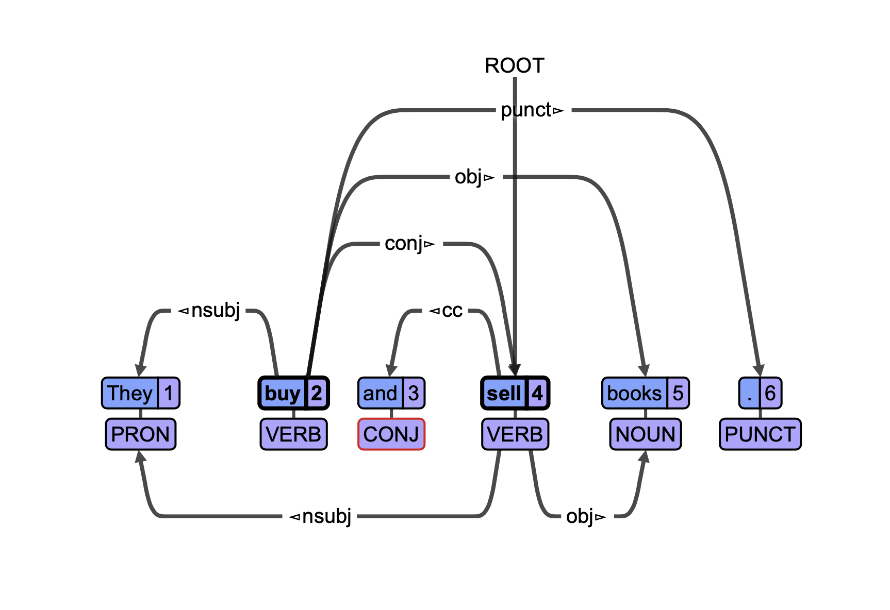

```{r setup, include=FALSE}
knitr::opts_chunk$set(echo = FALSE)
```

## Введение: что такое UD?

- Синтаксически размеченные корпуса (грамматика зависимостей)
- Стандартизированная разметка 
- 200 трибанков для ~100 языков
- NLP задачи (синтаксические парсеры) / типологические исследования


## Введение: что такое UD?

- Корпуса хранятся в формате CoNLL-U

```
1    They     they    PRON    PRP    Case=Nom|Number=Plur               2    nsubj    2:nsubj|4:nsubj
2    buy      buy     VERB    VBP    Number=Plur|Person=3|Tense=Pres    0    root     0:root
3    and      and     CONJ    CC     _                                  4    cc       4:cc
4    sell     sell    VERB    VBP    Number=Plur|Person=3|Tense=Pres    2    conj     0:root|2:conj
5    books    book    NOUN    NNS    Number=Plur                        2    obj      2:obj|4:obj
6    .        .       PUNCT   .      _                                  2    punct    2:punct
```
 
## Введение: что такое UD?

{#id .class width=50% height=50%}
 